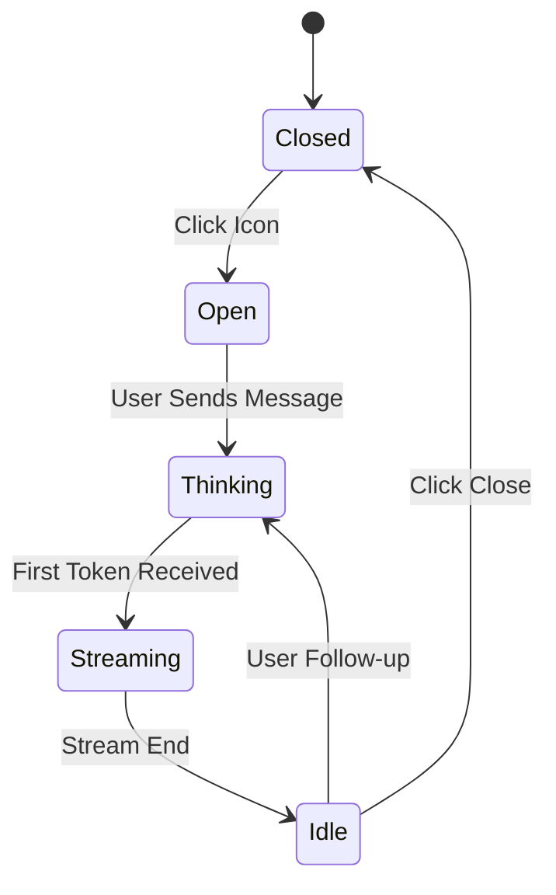

# UI/UX Specifications

## 1. Chat Widget State Machine

## 2. Responsive Breakpoints
-   **Mobile**: < 640px (1 column grid, Hamburger menu).
-   **Tablet**: 640px - 1024px (2 column grid).
-   **Desktop**: > 1024px (3 column grid, Sticky Header).

## 3. Accessibility (A11y)
-   **Keyboard Nav**: Chat widget must trap focus when open on mobile.
-   **Screen Readers**: All images must have `alt` tags. Prices must have `aria-label="450 rupees"`.
-   **Focus Indicators**: Visible outlines on all interactive elements.

## 4. Style Guide
-   **Primary Color**: `#FFA726` (Honey Gold)
-   **Secondary Color**: `#D46F00` (Amber)
-   **Font**: Open Sans (UI), Playfair Display (Headings)
