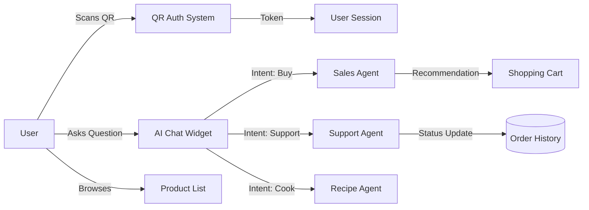

# Project Requirement Document (PRD) - BeeManHoney AI Platform

## 1. Executive Summary
BeeManHoney is transitioning from a static e-commerce site to an AI-driven platform. The core value proposition is the integration of "Deep Agents" that act as personalized apiarists, guiding users through product selection, recipes, and order management using natural language.

## 2. User Journey Flow



## 3. Core Features & Gherkin Scenarios

### 3.1. Authentication (Hybrid)
**Requirement**: Support Email/Password, OAuth (Google/GitHub), and Physical QR Token login.
**Priority**: P0
**Scenario**: QR Login Flow
```gherkin
Given a user holds a honey jar with a unique QR code "honey_batch_24_xyz"
And the code corresponds to a valid "Guest_Scanner" role in Redis
When the user scans the code via the frontend camera UI
Then the backend validates the token signature
And returns a temporary JWT with scope "read:product_provenance"
```

### 3.2. Product Discovery (RAG + Hybrid Search)
**Requirement**: Semantic search using vector embeddings + keyword filtering.
**Priority**: P0
**Scenario**: Hybrid Search
```gherkin
Given the product "Manuka Honey" has embedding vector [0.1, 0.5, ...]
When a user searches "something medicinal for a sore throat"
Then the Search Agent retrieves top 5 semantic matches
And filters results by "In Stock" status
And returns "Manuka Honey UMF 15+" as the top recommendation
```

### 3.3. AI Customer Support (LangGraph)
**Requirement**: Multi-turn conversation state management.
**Priority**: P1
**Scenario**: Contextual Memory
```gherkin
Given a user previously asked "Do you have vegan options?"
When they follow up with "Which one is the cheapest?"
Then the Agent recalls the previous filter (Vegan/Plant-based context)
And sorts the "Vegan" subset by price ascending
And responds "The Wildflower Honey is our most affordable option."
```

## 4. Non-Functional Requirements (NFRs)
1.  **Latency**:
    -   Vector Search: < 200ms.
    -   LLM Streaming TTFT (Time To First Token): < 1.5s.
2.  **Reliability**:
    -   The "Buy" button must work even if the AI Agent is down (Graceful Degradation).
3.  **Security**:
    -   All Chat inputs must be sanitized for Prompt Injection attacks.
    -   Rate limiting: 100 req/min per IP.

## 5. Edge Cases
-   **Inventory Race Condition**: Two users buying the last jar simultaneously. *Solution*: Optimistic locking on the database.
-   **LLM Hallucination**: Agent inventing a product. *Solution*: RAG strictness—Agent can only recommend products present in the `product_search` tool output.
