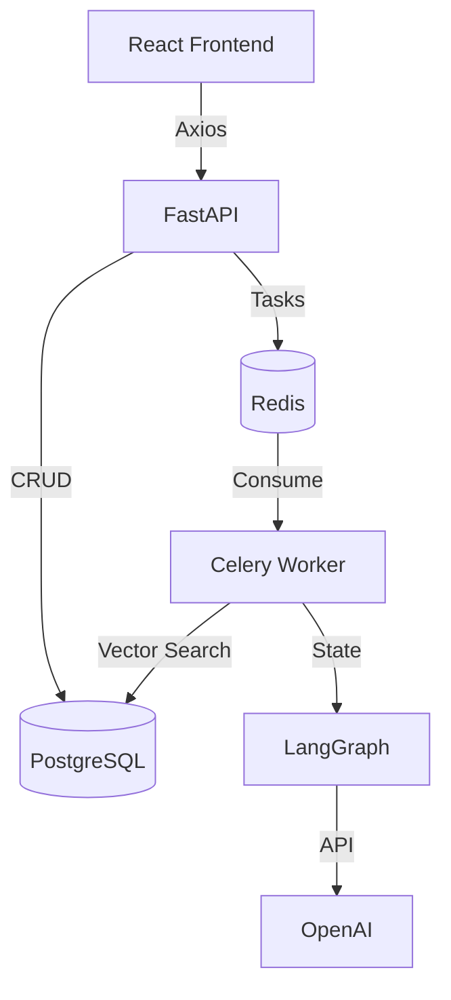

# Master Requirements & Compatibility Matrix

## 1. Full Stack Compatibility
-   **API Protocol**: REST (JSON) + SSE (EventSource).
-   **Auth**: Bearer Token (JWT).
-   **Validation**: Pydantic v2 (Backend) <-> Zod/Manual (Frontend).

## 2. Versioning
-   **Frontend**: `v1.0.0`
-   **Backend**: `v1.0.0` (API prefix `/api/v1`)
-   **DB Schema**: Revision `head` (Alembic).

## 3. Architecture Dependency Graph

## 4. Development Standards
-   **Linting**: ESLint (Frontend) + Ruff (Backend).
-   **Formatting**: Prettier (Frontend) + Black (Backend).
-   **Testing**: Vitest (Frontend) + Pytest (Backend).
