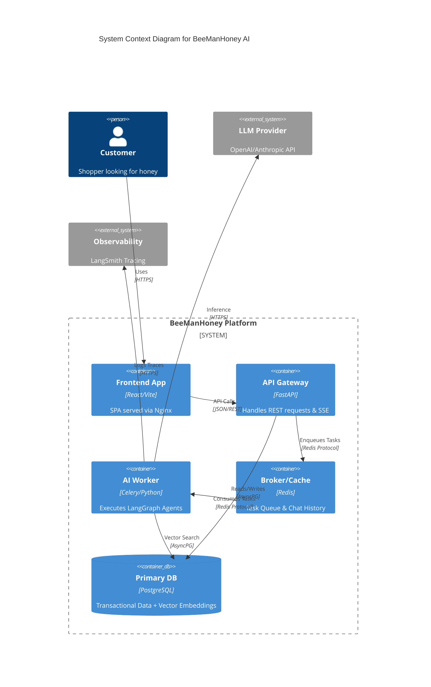

# System Architecture

## 1. Container Architecture Diagram

## 2. Component Detail

### 2.1. API Gateway (FastAPI)
-   **Responsibility**:
    -   Request Validation (Pydantic).
    -   JWT Authentication Middleware.
    -   Server-Sent Events (SSE) for streaming chat responses.
-   **Scaling**: Stateless. Horizontally scalable behind a Load Balancer.

### 2.2. Async Worker (Celery)
-   **Responsibility**:
    -   Running the `LangGraph` state machine.
    -   Heavy vector indexing jobs.
    -   Sending emails (Contact form).
-   **Concurrency**: Prefork execution pool to handle CPU-bound (serialization) and I/O-bound (LLM calls) tasks.

### 2.3. Data Persistence Layer
-   **PostgreSQL**:
    -   **Schema**: Relational (Orders, Users) + Vector (Product Embeddings).
    -   **Extension**: `pgvector` for High-dimensional vector search.
-   **Redis**:
    -   **Role**: Pub/Sub broker for Celery.
    -   **Cache**: Storing user session state and chat history (TTL 1 hour).

## 3. Technology Stack Versions
| Component | Technology | Version | Rationale |
| :--- | :--- | :--- | :--- |
| **Frontend** | React | 18.2.0 | Stable, ecosystem support. |
| **Backend** | Python | 3.11 | 10-60% faster than 3.10. |
| **API** | FastAPI | 0.109+ | Native AsyncIO, Auto OpenAPI docs. |
| **Orchestrator** | LangGraph | 0.0.20+ | Stateful agent cycles, cyclic graphs. |
| **DB** | PostgreSQL | 16 | Native performance improvements. |
| **Vector** | pgvector | 0.5.1 | HNSW indexing support. |
