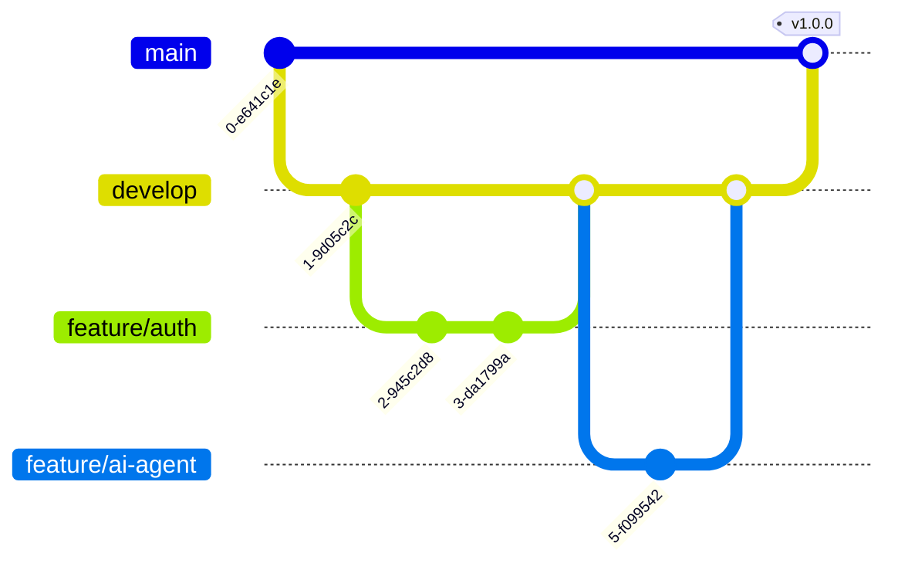

# Development Workflow

## 1. Branching Strategy (GitFlow)

1.  **main**: Production-ready. Deployable.
2.  **develop**: Staging. All features merge here first.
3.  **feature/name**: Individual tasks.

## 2. CI/CD Pipeline Visualization

## 3. Tooling Configuration

### 3.1. Pre-Commit Hooks
Configure `.pre-commit-config.yaml` to run:
-   `black` (Python formatting)
-   `ruff` (Python linting)
-   `prettier` (JS/TS formatting)

### 3.2. Code Review Checklist
-   [ ] Are Pydantic models strict?
-   [ ] Are async functions awaited?
-   [ ] Are database sessions closed/yielded correctly?
-   [ ] Does the PR include a migration file if models changed?
