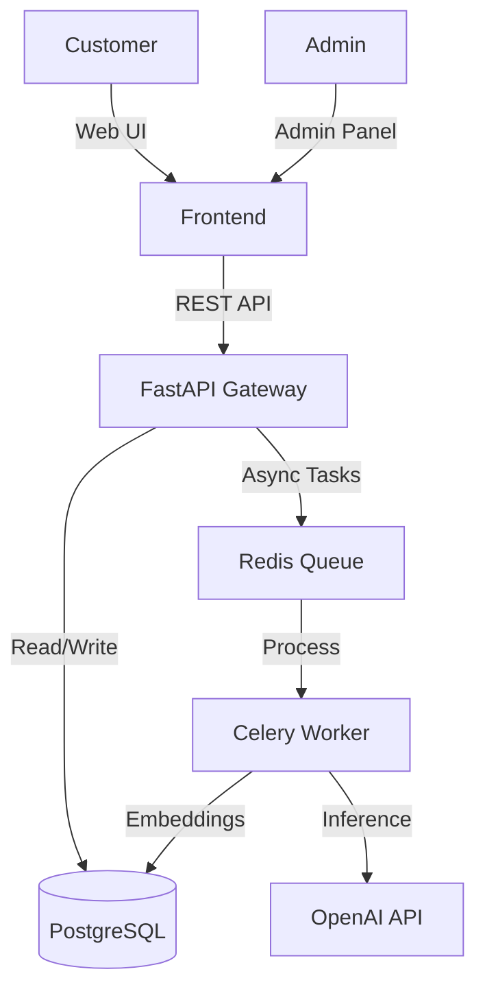

# High Level Design (HLD)

## 1. System Context Diagram

## 2. Key Modules

### 2.1. Product Ingestion
-   **Flow**: Admin uploads CSV -> API -> Celery Task -> Generate Embeddings -> Store in `pgvector`.
-   **Rationale**: Async processing ensures the Admin UI doesn't freeze during bulk uploads.

### 2.2. Chat Processing
-   **Flow**: User sends message -> API (create `Thread`) -> Celery (Supervisor Node) -> Agent Node -> Tool Execution -> Response.
-   **Streaming**: The API subscribes to the Agent's output via Redis Pub/Sub to stream tokens to the Frontend via SSE.

## 3. Design Constraints
1.  **Stateless API**: No local memory. All state must be in Redis or Postgres.
2.  **Consistency**: Order data (Postgres) is the source of truth. Vector data is a derived view.
3.  **Scalability**: The `Worker` container can be scaled independently of the `API` container depending on AI load.
