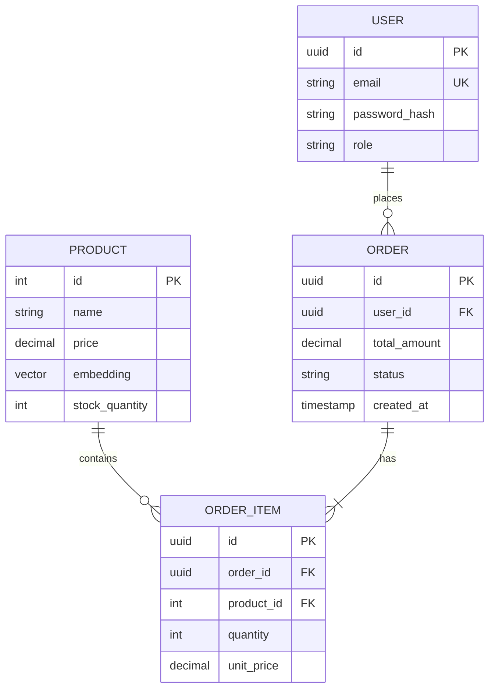

# Low Level Design (LLD)

## 1. Entity Relationship Diagram (ERD)



## 2. Database Schema Details

### Table: `products`
-   **id**: `SERIAL PRIMARY KEY`
-   **embedding**: `vector(1536)` (Requires `CREATE EXTENSION vector;`)
-   **Index**: `CREATE INDEX ON products USING hnsw (embedding vector_cosine_ops);` (For fast similarity search).

### Table: `users`
-   **id**: `UUID DEFAULT gen_random_uuid()`
-   **role**: `VARCHAR(20) DEFAULT 'customer'` (Values: 'customer', 'admin', 'guest_scanner').

## 3. Class Structure (Python)

### 3.1. LangGraph State
```python
class AgentState(TypedDict):
    input: str
    chat_history: list[BaseMessage]
    agent_outcome: Union[AgentAction, AgentFinish, None]
    intermediate_steps: list[tuple[AgentAction, str]]
```

### 3.2. Product Service
```python
class ProductService:
    def __init__(self, db: AsyncSession):
        self.db = db
        
    async def get_similar_products(self, query_vector: list[float], k: int = 5):
        # SQLAlchemy select statement with ordering by cosine distance
        pass
```
